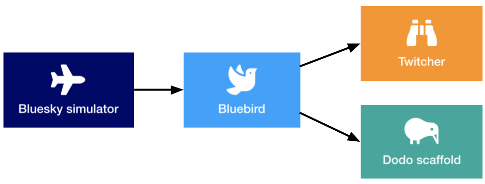

# Simurgh

*Simugh* pronounced _Seymour_ is a project that aims to develop a research-focused
open source simulation platform, along with a user-friendly interface for
evaluating different machine learning algorithms for real-time decision-making,
from optimisation approaches to reinforcement learning, in a complex and
uncertain environment.

Air traffic control is a complex task requiring real-time planning under
uncertainty, predicting potential conflicts and issuing commands to aircraft
pilots to ensure safety. This project investigates machine learning methods that
can be applied to this domain and could in future help air traffic controllers
in effective decision-making. Using simulations similar to training scenarios
for actual air traffic controllers, the project builds an open experimentation
platform to evaluate possible machine learning approaches to this task, and
explores algorithms to 'play' the simulation in the role of air traffic
controllers.

The [Simurgh](https://en.wikipedia.org/wiki/Simurgh) project contains several
elements that all work together to achieve the aims laid out above; these are:

- [Bluesky](https://github.com/alan-turing-institute/bluesky) - open source air traffic simulator

- [Bluebird](https://github.com/alan-turing-institute/bluebird) - server that handles communication between Bluesky and air traffic control agents

- [Twitcher](https://github.com/alan-turing-institute/twitcher) - front-end for monitoring the simulation

- [Dodo](https://github.com/alan-turing-institute/dodo) - scaffolds for ATC agents in Python, R, and potentially other languages

- [NATS birdhouse](https://github.com/alan-turing-institute/nats-birdhouse) - some ATC agents (currently in Python)

# Installation

In order to get things up and running, it is important to emphasise the
dependencies tree of the packages outlined above.



A full step-by-step installation guide can be found at: `www.placeholder-website-name.com>`.

However, if one would like to get up and running immediately this set of
commands will install all dependencies and start the application using Docker by
running:

```bash
bash install.sh
```

## Bluesky

Original instructions state:

```bash
conda install pyqt numpy scipy matplotlib pandas

pip install msgpack pyzmq pygame pyqtwebengine
```

Found it easier to have `environment.yml` file instead.

```bash
# This file may be used to create an environment using:
# $ conda env create --name <env> --file <this file>
# platform: linux-64
name: nats

channels:
  - conda-forge

dependencies:
  - python=3.6
  - pyqt
  - numpy
  - scipy
  - matplotlib
  - pandas

  - pip:
    - msgpack
    - pyzmq
    - pygame
    - pyqtwebengine
    - pyopengl
    - pyopengl-accelerate
```

```bash
conda env create -q && conda activate nats
```

Now that dependencies are install for both Bluesky & Bluebird, we can at least
check that these are OK by running `check.py` inside the Bluesky repository.

Running `python bluesky/check.py `will produce the following output:

```bash
(nats) $$ python bluesky/check.py
This script checks the availability of the libraries required by BlueSky, and
the capabilities of your system.

Checking for numpy               [OK]
Checking for scipy               [OK]
Checking for matplotlib          [OK]
Checking for pyqt                [QT5]
Checking for pyopengl            [OK]
OpenGL module version is         [3.1.0]
Checking GL capabilities         [OK]
GL Version at least 3.3          [OK]
Supported GL version             [4.1]
Checking for pygame              pygame 1.9.6
Hello from the pygame community. https://www.pygame.org/contribute.html
[OK]

You have all the required libraries to run BlueSky. You can use both the QTGL
and the pygame versions.
Checking bluesky modules
StateBasedCD: using Python version.
Could not import pyclipper, RESO SSD will not function
Using Open Aircraft Performance (OpenAP) model
Successfully loaded all BlueSky modules. Start BlueSky by running BlueSky.py.

``````

The above command only checks the dependencies for Bluesky, if it was indeed
successful, we can now install Bluesky into the Python path with:

```bash
python setup.py install
```

From here, all the nessessary items should be installed, Bluesky can now be
launched with:
```bash
(nats) $$ python bluesky/Bluesky.py

```
## Documentation

The documentation for this project can be found at `<www.placeholder-website-name.com>`.
Alternatively one can build and view these locally if one has `mkdocs`
installed. To do this, in the top level of this repository, run:

```bash
mkdocs serve
```

The corresponding _readthedocs_ can be found on `localhost:8000`

NOTE. If files are removed from 'docs/' in between builds, they make
still hang around, a better command to run would be:

```bash
mkdocs build --clean
```

followed by `mkdocs serve`
